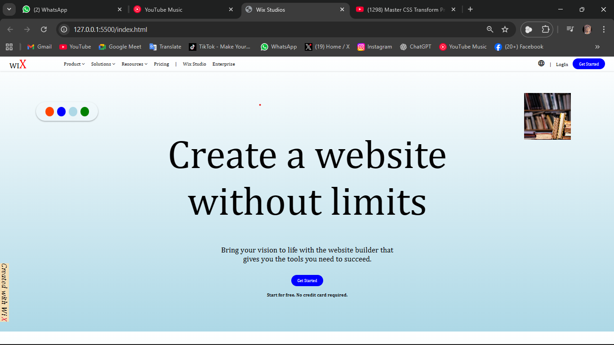

# Wix Studios Clone  

This project is a simple responsive web page inspired by **Wix Studios**, built using **HTML**, **CSS**, and **JavaScript**. It features a navigation bar, a color palette that dynamically changes the background gradient, and a styled footer.  

---

## 🚀 Features  
- **Responsive Design**: Works smoothly on desktop, tablet, and mobile devices.  
- **Dynamic Background**: Click on a color palette option to update the page’s gradient background.  
- **Interactive Navigation**: Hover effects for menu items and call-to-action button.  
- **Footer Branding**: Rotated “Created with Wix” footer element aligned at the bottom-left.  

---

## 🛠️ Technologies Used  
- **HTML5** – Structure of the webpage.  
- **CSS3 (Flexbox & Media Queries)** – Styling and responsiveness.  
- **JavaScript (ES6)** – Handles dynamic background changes.  

---

## 📂 Project Structure  
```bash
.
├── index.html      # Main HTML structure
├── style.css       # Stylesheet for layout & responsiveness
├── scripts.js      # JavaScript for dynamic interactions
├── images/         # Image assets (like hardcover.jpg)
└── README.md       # Project documentation
```

---

## ⚙️ Setup & Usage  
1. Clone the repository:  
   ```bash
   git clone https://github.com/your-username/your-repo-name.git
   ```  

2. Open `index.html` in your browser.  

---

## 🎨 How It Works  
- The **color palette buttons** each have a `data-color` attribute.  
- On click, JavaScript updates the background gradient:  

```javascript
document.body.style.background = `linear-gradient(to bottom, white, ${color})`;
```

---

## 📱 Responsiveness  
- **Tablet (≤ 768px)** → Navbar stacks, content centers.  
- **Mobile (≤ 480px)** → Text shrinks, buttons stretch, layout stacks vertically.  

---

## 📸 Preview  
  
*(Replace with an actual screenshot of your project if you want.)*  

---

## 📜 License  
This project is for **educational purposes** only and not affiliated with Wix.  
